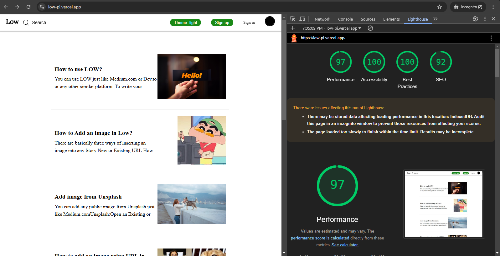

<picture>
<source srcset="public/low-dark.svg" media="(prefers-color-scheme: dark)" />
<source srcset="public/low-light.svg" media="(prefers-color-scheme: light)" />

</picture>

Think Medium.com, but with a twist that makes life easier for both writers and readers. The main idea is simple: write something once, then remix and reuse it however you want. No more starting from scratch every time.

You get all the good stuff you'd expect - writing stories, dropping comments, showing love with claps, and making your profile shine. But we've added some neat features too. There's a built-in dictionary when you need it, and you can switch between light and dark modes to save your eyes.

The big difference from Medium? We're all about keeping things low-effort. Instead of treating each piece of writing as a one-and-done deal, we've made it super easy to breathe new life into existing stories.

---

## **Features**

### **Core Functionality**

- **User Authentication**:
  - Google Sign-In for secure and streamlined authentication.
- **Post Management**:

  - Create, read, update, and delete (CRUD) operations for posts (stories).
  - Detailed story pages with content rendering.

- **Comment System**:

  - Add, read, and manage comments on stories.
  - Nested commenting for in-depth discussions.

- **Clap System**:

  - Clap functionality for stories and comments to engage with content.

- **User Profile**:
  - Update profile information, including name, avatar, and bio.

---

## **Tech Stack**

### **Frontend**

- **React**: For building dynamic and responsive user interfaces.
- **React Router**: For client-side routing and navigation.
- **Module CSS**: For modern, isolated and responsive styling.
- **Lexical Editor**: For Robust text editing.

### **Backend**

- **Firebase**:

  - **Authentication**: Google Sign-In integration for user management.
  - **Firestore Database**: Firestore NoSQL database for storing posts, comments, and claps.

- **Vercel**: For seamless deployment.

---

## **Lighthouse results for Performance, Accessibility, Best Practices and SEO:**

## 

## **Setup Instructions**

Follow these steps to run the project locally:

### **1. Clone the Repository**

```bash
git clone https://github.com/playstore777/low.git
cd low
```

### **2. Install Dependencies**

```bash
npm install
```

### **3. Firebase Setup**

1. Go to the [Firebase Console](https://console.firebase.google.com/).
2. Create a new project (or use an existing one).
3. Enable **Firestore Database** and **Authentication** (Google Sign-In).
4. Copy your Firebase configuration object from the Firebase Console and replace the placeholder in your code:
   ```javascript
   const firebaseConfig = {
     apiKey: "your-api-key",
     authDomain: "your-auth-domain",
     projectId: "your-project-id",
     storageBucket: "your-storage-bucket",
     messagingSenderId: "your-sender-id",
     appId: "your-app-id",
   };
   ```
   or create .env file and update these:
   ```dotenv
   # use the following variables for .env file
   VITE_UNSPLASH_ACCESS_KEY
   VITE_DEV_FIREBASE_API_KEY
   VITE_DEV_FIREBASE_AUTH_DOMAIN
   VITE_DEV_FIREBASE_PROJECT_ID
   VITE_DEV_FIREBASE_STORAGE_BUCKET
   VITE_DEV_FIREBASE_MESSAGING_SENDER_ID
   VITE_DEV_FIREBASE_APP_ID
   VITE_DEV_MEASUREMENT_ID # if enabled analytics in firebase
   ```
5. Create indexes for "comments" and "posts".
   - comments <i>(column-order)</i>: <b>postId</b>-Descending; <b>parentId</b>-Ascending; <b>timestamp</b>-Ascending;
   - posts <i>(column-order)</i>: <b>userId</b>-Ascending; <b>createdAt</b>-Descending;
6. Create rules for "comments", "posts", and "users".
   - /users/{userId}: allow all <b>read</b>, only authenticated owner can <b>write</b>
   - /comments/{commentId}: allow all <b>read</b>, only authenticated user can <b>create</b> and update (since anybody can clap), only owner can <b>delete</b>
   - /posts/{postId}: allow all <b>read</b>, only authenticated user can <b>create</b> and update (since anybody can clap), only owner can <b>delete</b>

### **4. Run the Application**

```bash
npm run dev
```

The app will be available at `http://localhost:5173`.

---

## **Usage**

1. **Sign Up/Sign In**:

   - Use Google Sign-In to log in to your account.

2. **Create a Story**:

   - Click on the "Write" button and write a story.
   - Add a title and content before publishing.

3. **Comment on Stories**:

   - Visit a story page and post comments to interact with the content.

4. **Clap for Stories and Comments**:

   - Engage with posts and comments by clicking the clap icon.

5. **Update Profile**:
   - Go to your profile section to update your name, avatar, or bio.

---

## **Future Enhancements**

This project is a work in progress. Planned features include:

- **Reusable story on-demand**: Only show nested story if request.
- **Segmented story**: Only use some part of the story in other stories.
- **Tagging and Categorization**: Add tags to stories for better discoverability.
- **Filtering**: filter by tags, popularity, or date.
- **Followers and Following**: See your followers and your follows.
- **Notifications**: Notify users of interactions like claps and comments.
- **Analytics**: Track views and engagement on stories.

---

## **Contributing**

Contributions are welcome! Follow these steps to contribute:

1. Fork the repository.
2. Create a new branch for your feature:
   ```bash
   git checkout -b feature-name
   ```
3. Make your changes and commit them:
   ```bash
   git commit -m "Add feature-name"
   ```
4. Push to your fork:
   ```bash
   git push origin feature-name
   ```
5. Open a pull request.

---

## **License**

This project is licensed under the MIT License. See the [LICENSE](LICENSE) file for details.

---

## **Screenshots**

1. The home page.
2. A story page with comments.
3. The story creation page.
4. Add Reusable story and view.
5. Profile editing.

---

## **Contact**

If you have any questions or suggestions, feel free to contact:

- **Mohammed Adil Sharif**: [mdadilsharif2@gmail.com](mailto:mdadilsharif2@gmail.com)
- [GitHub Profile](https://github.com/playstore777)

---
